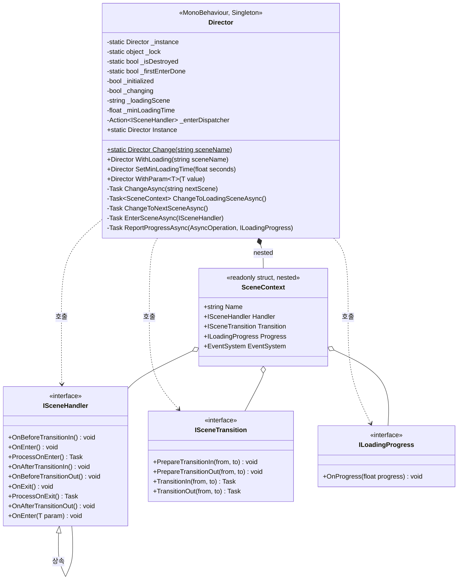
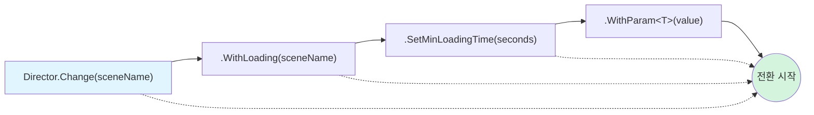
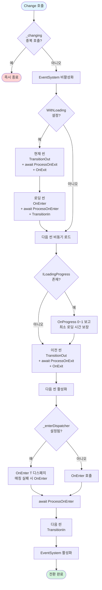
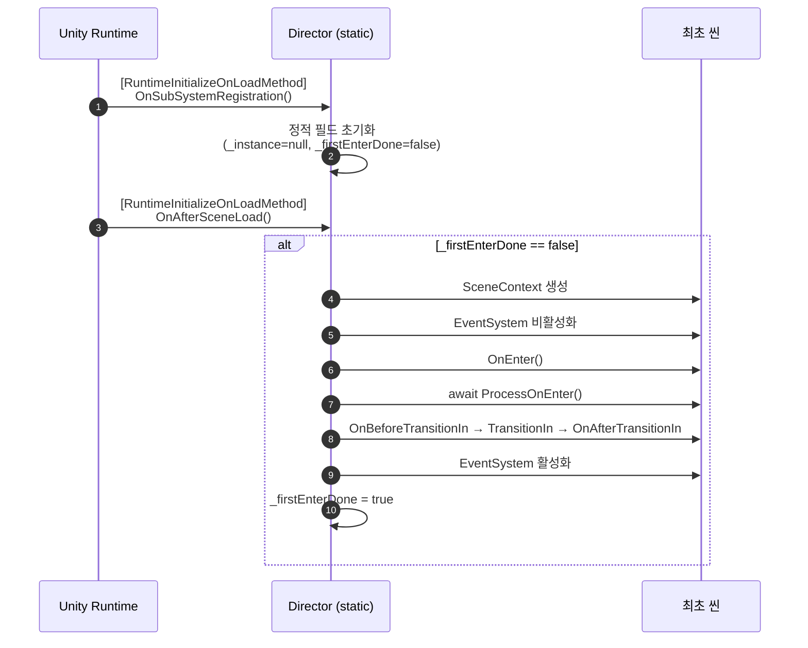
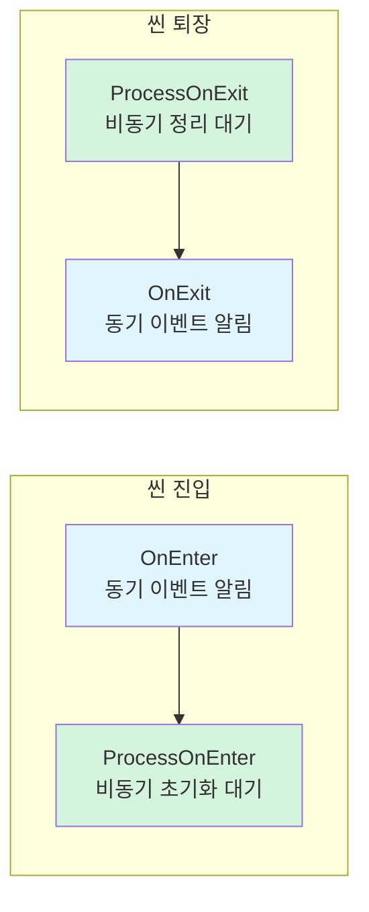

# Director 구조 다이어그램

`com.darknaku.director` v0.6.3 — Unity 씬 전환 오케스트레이터의 구조를 Mermaid 다이어그램으로 정리한 문서입니다.

## 1. 클래스 다이어그램

런타임 라이브러리(`Assets/Director/Runtime/`)의 핵심 타입과 관계를 표현합니다.



## 2. 빌더 패턴 (Fluent API)

`Director.Change()`로 시작하는 옵션 체이닝 흐름입니다.



> 모든 옵션은 선택사항이며 `Director.Change()`만으로도 즉시 전환이 시작됩니다.
> `WithParam<T>(value)`는 박싱·리플렉션 없이 클로저(`Action<ISceneHandler>`)를 캡처하여 다음 씬 진입 시 디스패치합니다.

## 3. 씬 전환 시퀀스 (로딩 씬 경유)

`WithLoading()`이 설정된 경우의 전체 라이프사이클입니다. 진입은 `OnEnter → ProcessOnEnter`, 퇴장은 `ProcessOnExit → OnExit` 순서로 호출됩니다.

```mermaid
sequenceDiagram
    autonumber
    actor Caller as 호출자
    participant D as Director
    participant Cur as 현재 씬<br/>(Handler/Transition)
    participant Load as 로딩 씬<br/>(Handler/Progress/Transition)
    participant Next as 다음 씬<br/>(Handler/Transition)
    participant SM as SceneManager

    Caller->>D: Change("Next").WithLoading("Loading").WithParam(x)
    D->>D: EventSystem 비활성화

    Note over D,Cur: --- 현재 씬 → 로딩 씬 ---
    D->>SM: LoadSceneAsync("Loading")
    D->>Cur: OnBeforeTransitionOut()
    D->>Cur: PrepareTransitionOut + TransitionOut()
    D->>Cur: OnAfterTransitionOut()
    D->>Cur: await ProcessOnExit()
    D->>Cur: OnExit()
    D->>SM: allowSceneActivation = true

    D->>Load: OnEnter()
    D->>Load: await ProcessOnEnter()
    D->>Load: OnBeforeTransitionIn → TransitionIn → OnAfterTransitionIn

    Note over D,Next: --- 로딩 씬 → 다음 씬 ---
    D->>SM: LoadSceneAsync("Next")
    loop 로드 진행률 + 최소 로딩 시간
        D->>Load: OnProgress(ratio)
    end
    D->>Load: OnProgress(1f)

    D->>Load: OnBeforeTransitionOut → TransitionOut → OnAfterTransitionOut
    D->>Load: await ProcessOnExit()
    D->>Load: OnExit()
    D->>SM: allowSceneActivation = true

    D->>D: EventSystem 비활성화
    D->>Next: OnBeforeTransitionIn + PrepareTransitionIn
    alt _enterDispatcher 있고 ISceneHandler&lt;T&gt; 매칭
        D->>Next: OnEnter(param) (클로저 디스패치)
    else
        D->>Next: OnEnter()
    end
    D->>Next: await ProcessOnEnter()
    D->>Next: TransitionIn → OnAfterTransitionIn
    D->>D: EventSystem 활성화
```

## 4. 씬 전환 흐름도 (의사결정 단순화 뷰)



## 5. 첫 씬 진입 라이프사이클

`Director` 인스턴스가 없어도 자동으로 트리거되는 최초 씬 흐름입니다.



## 6. 진입·퇴장 콜백 분리 패턴

`ISceneHandler`의 진입·퇴장은 **동기 이벤트**와 **비동기 후속 처리**로 분리되어 있습니다.

| 단계 | 동기 이벤트 | 비동기 처리 | 호출 순서 |
|---|---|---|---|
| 진입 | `void OnEnter()` (또는 `OnEnter(T)`) | `Task ProcessOnEnter()` | `OnEnter` → `await ProcessOnEnter` |
| 퇴장 | `void OnExit()` | `Task ProcessOnExit()` | `await ProcessOnExit` → `OnExit` |



의미:
- **진입**: 먼저 동기 `OnEnter`로 "들어왔다"를 알리고, 이어서 `ProcessOnEnter`로 비동기 초기화(에셋 로드 등)를 처리. 트랜지션 인은 비동기 초기화가 끝난 뒤에야 실행되어 초기화 중 화면이 노출되지 않습니다.
- **퇴장**: 먼저 `ProcessOnExit`로 비동기 정리(저장, 네트워크 종료 등)를 마치고, 마지막에 동기 `OnExit`로 "나간다"를 알린 뒤 씬을 언로드합니다.
- 비동기 작업이 없는 핸들러는 `Process*` 메서드를 오버라이드하지 않으면 기본 구현(`Task.CompletedTask`)이 즉시 반환되어 추가 비용이 없습니다.

> 예외: `OnApplicationQuit`은 앱 종료 시점이므로 동기 `OnExit`만 호출하고 `ProcessOnExit`는 호출되지 않습니다 (콜백을 대기할 메인 루프가 곧 사라지므로).

---

## 핵심 관찰 포인트

- **싱글톤**: 이중 잠금(double-checked locking)으로 스레드 안전하게 구현되어 있으며 `DontDestroyOnLoad`로 유지됩니다.
- **비동기 모델**: 모든 전환은 `Task` 기반으로, `Task.Yield()`로 프레임 단위 동기화를 수행합니다 (`async void` 없음).
- **컴포넌트 탐색**: `SceneContext`는 씬의 **루트 GameObject만** 순회하여 인터페이스 구현체를 찾습니다 (자식은 탐색하지 않음).
- **타입 파라미터 전달**: `WithParam<T>(value)`은 호출 시점에 `Action<ISceneHandler>` 클로저를 캡처합니다. `T`가 값 타입이어도 strongly-typed 필드로 저장되므로 **박싱 없음**. 다음 씬 진입 시 `handler is ISceneHandler<T>` 패턴 매칭으로 디스패치하며 **리플렉션도 사용하지 않습니다**. `ISceneHandler<in T>`의 contravariance 덕분에 부모 타입을 받는 핸들러도 자동 매칭됩니다.
- **진입·퇴장 분리**: `OnEnter`/`OnExit`(동기 이벤트)와 `ProcessOnEnter`/`ProcessOnExit`(비동기 처리)가 분리되어 있습니다. 진입은 `OnEnter → ProcessOnEnter`, 퇴장은 `ProcessOnExit → OnExit` 순서로 호출되어, 각각 "들어왔다 → 들어와서 처리", "처리 후 → 나간다"의 의미를 가집니다.
- **TransitionIn 분할 실행**: 다음 씬에서는 `PrepareTransitionIn`만 먼저 실행하고 `OnEnter` + `ProcessOnEnter` 호출 후 `TransitionIn` 본체를 실행하는 분리 구조입니다 (초기화 중 화면이 보이지 않도록).
- **EventSystem 제어**: 전환 도중 입력이 들어가지 않도록 비활성화 → 활성화 처리됩니다.
