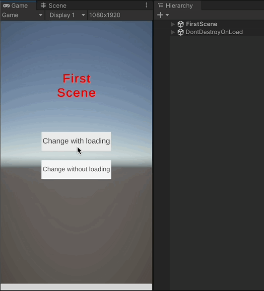

# Director


Unity 씬 전환을 위한 경량 라이브러리입니다. 전환 연출, 로딩 화면, 씬 간 파라미터 전달 등을 플루언트 API로 간편하게 처리할 수 있습니다.



## 주요 기능

- **전환 연출** — 페이드 등 시각적 효과를 씬 전환 시 적용
- **로딩 화면** — 로딩 씬을 지정하여 진행률과 함께 표시
- **최소 로딩 시간** — 로딩 화면이 너무 빨리 사라지는 것을 방지
- **파라미터 전달** — 다음 씬 핸들러에 타입 안전한 파라미터 전달
- **입력 차단** — 전환 중 EventSystem을 자동으로 비활성화하여 입력 방지
- **첫 씬 지원** — 앱 시작 시 첫 번째 씬에서도 자동으로 라이프사이클 호출

## 설치 방법

Unity Package Manager에서 Git URL로 설치합니다.

1. 패키지 관리자 좌측 상단의 **+** 버튼 클릭
2. **Add package from git URL** 선택
3. 아래 URL 입력 후 **Add** 클릭

```
https://github.com/DarkNaku/Director.git?path=/Assets/Director
```

## 빠른 시작

### 기본 씬 전환

```csharp
Director.Change("NextScene");
```

### 로딩 화면과 함께 전환

```csharp
Director.Change("NextScene").WithLoading("LoadingScene");
```

### 최소 로딩 시간 설정

```csharp
Director.Change("NextScene").WithLoading("LoadingScene").SetMinLoadingTime(2f);
```

### 파라미터 전달

```csharp
Director.Change("NextScene").WithParam(100);
```

### 모든 옵션 조합

```csharp
Director.Change("NextScene")
    .WithLoading("LoadingScene")
    .SetMinLoadingTime(1f)
    .WithParam(123);
```

## 인터페이스

Director는 3개의 인터페이스를 통해 씬의 동작을 정의합니다. 씬의 루트 GameObject에 붙은 MonoBehaviour에서 구현하면 Director가 자동으로 탐지합니다.

### ISceneHandler

씬의 라이프사이클 이벤트를 처리합니다. 모든 메서드는 기본 구현이 있어 필요한 것만 오버라이드하면 됩니다.

진입·퇴장 콜백은 **동기 이벤트(`OnEnterScene`/`OnExitScene`)** 와 **비동기 후속 처리(`ProcessOnEnterScene`/`ProcessOnExitScene`)** 로 분리되어 있습니다. 동기 이벤트만 필요하면 `OnEnterScene`/`OnExitScene`만 오버라이드하고, 비동기 작업(에셋 로드 등)이 필요하면 `ProcessOnEnterScene`/`ProcessOnExitScene`에서 처리하세요.

```csharp
public class MySceneHandler : MonoBehaviour, ISceneHandler {
    public void OnEnterScene() {
        // 씬 진입 시 동기 초기화
    }

    public async Task ProcessOnEnterScene() {
        // 씬 진입 직후 Director가 완료를 대기하는 비동기 작업 (선택)
        await LoadAssetsAsync();
    }

    public void OnExitScene() {
        // 씬 퇴장 시 동기 정리
    }

    public async Task ProcessOnExitScene() {
        // 씬 퇴장 직전 Director가 완료를 대기하는 비동기 작업 (선택)
        await SaveAsync();
    }

    public void OnBeforeTransitionIn() { }   // TransitionIn 직전
    public void OnAfterTransitionIn() { }    // TransitionIn 직후
    public void OnBeforeTransitionOut() { }  // TransitionOut 직전
    public void OnAfterTransitionOut() { }   // TransitionOut 직후
}
```

### ISceneHandler\<T>

`ISceneHandler`를 상속하며, 이전 씬에서 `WithParam<T>()`으로 전달한 파라미터를 받을 수 있습니다.

```csharp
public class MySceneHandler : MonoBehaviour, ISceneHandler<int> {
    public void OnEnterScene(int value) {
        Debug.Log($"전달받은 값: {value}");
    }

    // 비동기 초기화가 필요하면 ProcessOnEnterScene에서 처리
    public Task ProcessOnEnterScene() => Task.CompletedTask;
}
```

### ISceneTransition

씬 전환 시 시각적 연출(페이드 등)을 정의합니다.

```csharp
public class MySceneHandler : MonoBehaviour, ISceneHandler, ISceneTransition {
    [SerializeField] private Image _curtain;

    public void PrepareTransitionIn(string from, string to) {
        _curtain.color = Color.black;
    }

    public async Task TransitionIn(string from, string to) {
        // 페이드 인 (검정 → 투명)
        await Fade(Color.black, Color.clear, 0.5f);
    }

    public void PrepareTransitionOut(string from, string to) {
        _curtain.color = Color.clear;
    }

    public async Task TransitionOut(string from, string to) {
        // 페이드 아웃 (투명 → 검정)
        await Fade(Color.clear, Color.black, 0.5f);
    }
}
```

### ILoadingProgress

로딩 진행률 업데이트를 받습니다. 로딩 씬 또는 현재 씬에서 구현할 수 있습니다.

```csharp
public class MySceneHandler : MonoBehaviour, ISceneHandler, ILoadingProgress {
    [SerializeField] private Slider _slider;

    public void OnProgress(float progress) {
        _slider.value = progress; // 0.0 ~ 1.0
    }
}
```

## 전환 흐름

```
Director.Change(next)
│
├─ EventSystem 비활성화
│
├─ 현재 씬
│   ├─ OnBeforeTransitionOut()
│   ├─ TransitionOut()              ← 페이드 아웃
│   ├─ OnAfterTransitionOut()
│   ├─ ProcessOnExitScene()         ← 비동기 정리 (await)
│   └─ OnExitScene()                ← 동기 정리 후 언로드
│
├─ 로딩 씬 (WithLoading 사용 시)
│   ├─ OnEnterScene()
│   ├─ ProcessOnEnterScene()        ← 비동기 초기화 (await)
│   ├─ TransitionIn()
│   ├─ OnProgress()                 ← 다음 씬 로드 중 반복 호출
│   ├─ TransitionOut()
│   ├─ ProcessOnExitScene()         ← 비동기 정리 (await)
│   └─ OnExitScene()                ← 언로드
│
├─ 다음 씬
│   ├─ OnEnterScene() 또는 OnEnterScene<T>(param)
│   ├─ ProcessOnEnterScene()        ← 비동기 초기화 (await)
│   ├─ OnBeforeTransitionIn()
│   ├─ TransitionIn()               ← 페이드 인
│   └─ OnAfterTransitionIn()
│
└─ EventSystem 재활성화
```

## 라이선스

[MIT License](LICENSE)

## 로드맵

- 전환 간 Additive Scene 추가/제거 기능
