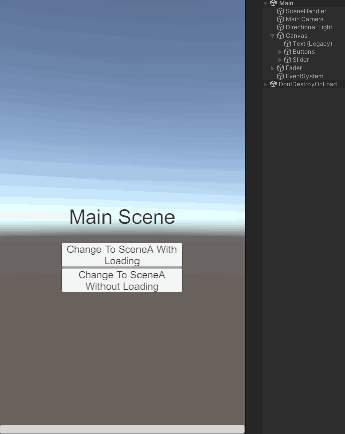

# Director

### 소개
Scene 사이의 전환 할 때 연출과 로딩을 표시하거나 핸들러를 통해 이벤트를 받는 등의 작업을 편리하게 하기 위한 라이브러리 입니다.



### 설치방법
1. 패키지 관리자의 툴바에서 좌측 상단에 플러스 메뉴를 클릭합니다.
2. 추가 메뉴에서 Add package from git URL을 선택하면 텍스트 상자와 Add 버튼이 나타납니다.
3. https://github.com/DarkNaku/Director.git 입력하고 Add를 클릭합니다.

### 사용방법
샘플 프로젝트를 포함하고 있으니 세부적인 구현 방법은 코드를 참고하세요.

```csharp
Director.Change("SceneA");

Director.Change("SceneA").WithLoading("Loading");

Director.Change("SceneA").WithLoading("Loading").SetMinLoadingTime(2f);
```

### 기능
* 로딩 화면 표시 가능
* 로딩 진행 상황 표시 가능
* 장면 사이 전환 효과 표현 가능
* 화면 전환 및 로딩 중 EventSystem 입력 제한

### 추가설명
* 전환간 Additive Scene을 더하고 빼는 기능은 추가 예정입니다.